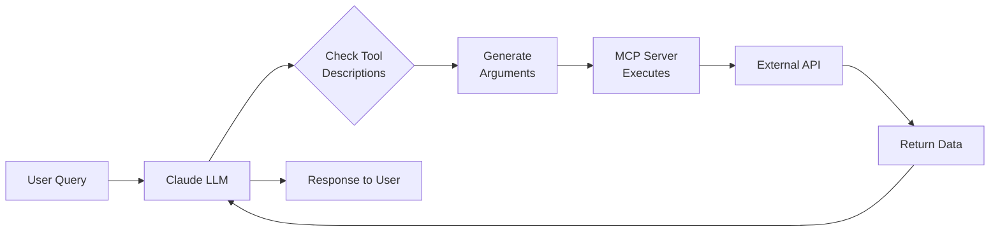

# MCP Server Flow Diagram

```mermaid
flowchart LR
    A[User Query] --> B[Claude LLM]
    B --> C{Check Tool<br/>Descriptions}
    C --> D[Generate<br/>Arguments]
    D --> E[MCP Server<br/>Executes]
    E --> F[External API]
    F --> G[Return Data]
    G --> B
    B --> H[Response to User]
```