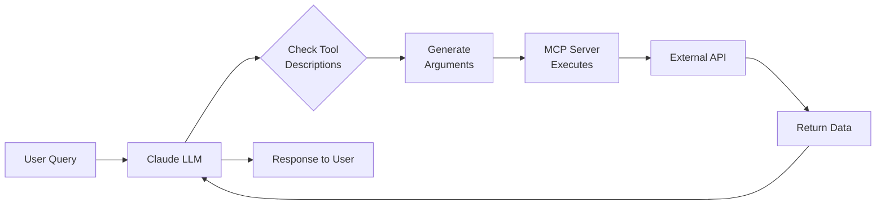

# Weather & News MCP Server

An MCP (Model Context Protocol) server that provides access to two free APIs:

1. **Weather API** - [Open-Meteo](https://open-meteo.com/) (no API key required)
2. **News API** - [NewsAPI.org](https://newsapi.org/) (free tier available)

## Features

### Weather Tools
- `get_weather`: Get current weather and forecast for any location
  - Support for coordinates (lat/lon) or city names
  - 7-day weather forecast
  - Temperature, humidity, wind speed, precipitation

- `search_location`: Geocode city names to coordinates

### News Tools
- `get_news`: Get latest news articles
  - Search by keywords/topics
  - Filter by category (business, tech, sports, etc.)
  - Filter by country
  - Configurable results count

## Installation

1. Install dependencies:
```bash
pip install -r requirements.txt
```

2. Get a free NewsAPI key:
   - Visit https://newsapi.org/register
   - Set environment variable:
```bash
export NEWSAPI_KEY="your_api_key_here"
```

## Usage

### Running the Server

```bash
python main.py
```

### Configuring with Claude Desktop

Add to your Claude Desktop config file: `~/Library/Application Support/Claude/claude_desktop_config.json`

```json
{
  "mcpServers": {
    "weather-news": {
      "command": "python",
      "args": ["/Users/yuhsuanting/code/DataScienKnowledge/AgenticAI/MCP/main.py"],
      "env": {
        "NEWSAPI_KEY": "your_api_key_here"
      }
    }
  }
}
```

### Example Queries

**Weather:**
- "What's the weather in Tokyo?"
- "Get me a 7-day forecast for New York"
- "Weather for coordinates 51.5074, -0.1278"

**News:**
- "Get the latest technology news"
- "Show me news about artificial intelligence"
- "Top headlines in the US"
- "Business news from the UK"

**Location:**
- "Find coordinates for Paris"
- "Search for London, UK"

## Tools Reference

### get_weather
```json
{
  "city": "London",           // OR use latitude/longitude
  "forecast_days": 3          // Optional, 1-7 days
}
```

### get_news
```json
{
  "query": "climate change",  
  "category": "technology",   // Optional: category filter
  "country": "us",           // Optional: country code
  "page_size": 10            // Optional: number of results
}
```

### search_location
```json
{
  "location": "Tokyo, Japan"
}
```
