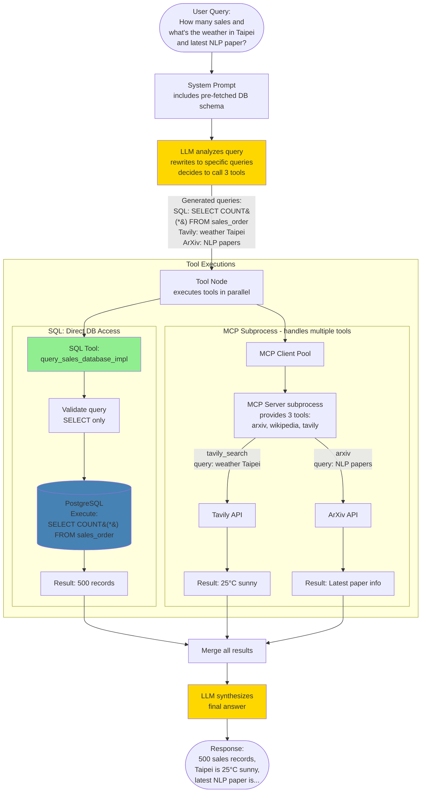

```mermaid
graph TD
    START([User Query:<br/>How many sales and<br/>what's the weather in Taipei<br/>and latest NLP paper?]) --> SYSTEM[System Prompt<br/>includes pre-fetched DB schema]

    SYSTEM --> LLM1[LLM analyzes query<br/>rewrites to specific queries<br/>decides to call 3 tools]

    LLM1 -->|Generated queries:<br/>SQL: SELECT COUNT&#40;*&#41; FROM sales_order<br/>Tavily: weather Taipei<br/>ArXiv: NLP papers| TOOLS[Tool Node<br/>executes tools in parallel]

    subgraph "Tool Executions"
        TOOLS --> SQL_EXEC[SQL Tool:<br/>query_sales_database_impl]
        TOOLS --> MCP_CLIENT[MCP Client Pool]

        subgraph "SQL: Direct DB Access"
            SQL_EXEC --> SQL_VALIDATE[Validate query<br/>SELECT only]
            SQL_VALIDATE --> SQL_DB[(PostgreSQL<br/>Execute:<br/>SELECT COUNT&#40;*&#41; FROM sales_order)]
            SQL_DB --> SQL_RESULT[Result: 500 records]
        end

        subgraph "MCP Subprocess - handles multiple tools"
            MCP_CLIENT --> MCP_SERVER[MCP Server subprocess<br/>provides 3 tools:<br/>arxiv, wikipedia, tavily]

            MCP_SERVER -->|tavily_search<br/>query: weather Taipei| TAVILY_API[Tavily API]
            MCP_SERVER -->|arxiv<br/>query: NLP papers| ARXIV_API[ArXiv API]

            TAVILY_API --> WEB_RESULT[Result: 25°C sunny]
            ARXIV_API --> PAPER_RESULT[Result: Latest paper info]
        end
    end

    SQL_RESULT --> MERGE[Merge all results]
    WEB_RESULT --> MERGE
    PAPER_RESULT --> MERGE

    MERGE --> LLM2[LLM synthesizes<br/>final answer]

    LLM2 --> END([Response:<br/>500 sales records,<br/>Taipei is 25°C sunny,<br/>latest NLP paper is...])

    style LLM1 fill:#FFD700
    style LLM2 fill:#FFD700
    style SQL_EXEC fill:#90EE90
    style SQL_DB fill:#4682B4
```