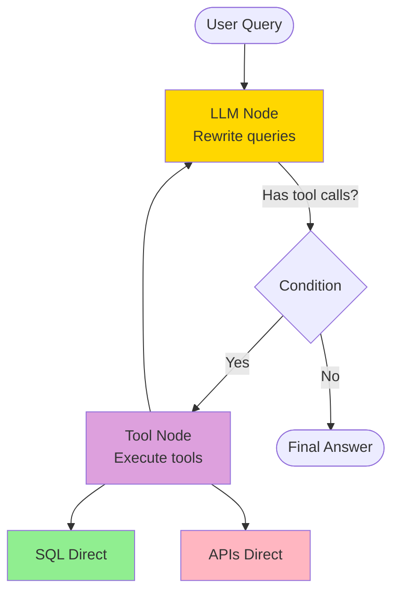
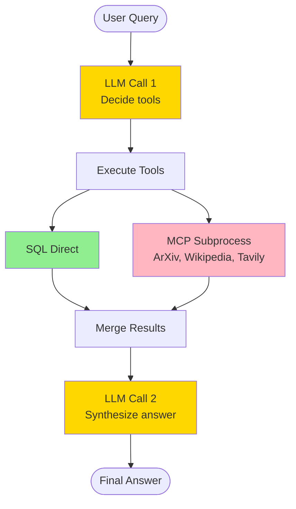

# Chatbot with MCP and LangGraph

Three approaches to building an AI chatbot with tool calling: simple LLM, LangGraph iterative, and MCP subprocess execution.

---

## most simple workflow

## 1. `/search` - Simple LLM Query

LLM has tools bound but doesn't execute them - returns raw response.

**Features:**
- ❌ Tools bound but never executed
- ❌ No tool result synthesis
- ⚠️ Response may contain tool call requests as text

**Use case:** Demo of non-functional tool binding

---

## 2. `/search_graph` - LangGraph Iterative

Automatic tool execution with looping.

**Features:**
- ✅ Automatic tool execution & looping
- ✅ All tools direct execution (SQL, ArXiv, Wikipedia, Tavily)

**Use case:** Complex multi-step queries

---

## 3. `/search_mcp` - Single-Pass with MCP

Manual execution, MCP subprocess for some tools.

**Features:**
- ✅ MCP subprocess (arxiv, wikipedia, tavily)
- ✅ SQL direct execution
- ❌ No automatic looping

**Use case:** Demonstrating MCP protocol

---

## 4. Hybrid: LangGraph + MCP *(concept, not implemented)*

Combines automatic iteration with MCP isolation.

**Why this is ideal:**
- ✅ LangGraph automatic iteration
- ✅ SQL direct (fast)
- ✅ MCP subprocess (isolated)

---

## Comparison

| Feature | `/search` | `/search_graph` | `/search_mcp` | Hybrid *(concept)* |
|---------|-----------|----------------|---------------|-------------------|
| Tool execution | ❌ None | ✅ Automatic | ✅ Manual | ✅ Automatic |
| Looping | ❌ No | ✅ Yes | ❌ No | ✅ Yes |
| MCP tools | ❌ No | ❌ No | ✅ Yes | ✅ Yes |
| SQL tools | ❌ No | ✅ Direct | ✅ Direct | ✅ Direct |
| Best for | Simple | Complex workflows | MCP demo | Production |

---

## Key Concepts

**Query Rewriting:** Done by LLM, not MCP
- User: "How many sales and weather in Taipei?"
- LLM rewrites: `{"sql": "SELECT COUNT(*)", "query": "weather Taipei"}`

**MCP Role:** Execute tools in subprocess, not rewrite queries

**Schema Pre-fetching:** Database schema cached at startup, injected in prompts

---

## Hybrid Approach: LangGraph + MCP *(concept)*

This combines the strengths of both architectures:

**From LangGraph:**
- Automatic iteration and looping
- Unified tool interface via `ToolNode`
- Parallel tool execution
- Error recovery and retry capability

**From MCP:**
- Process isolation (tools can crash safely)
- ersion delegation to protocol providers

**Combined Benefits:**
- ✅ Best of both: iteration + isolation
- ✅ Direct SQL (fast) + MCP subprocess (safe)

**Example:** Complex query requiring multiple tools with automatic retry/refinement.

```mermaid
graph TD
    START([User Query:<br/>How many sales and<br/>what's the weather in Taipei<br/>and latest NLP paper?]) --> SYSTEM[System Prompt<br/>includes pre-fetched DB schema]

    SYSTEM --> LLM1[LLM analyzes query<br/>rewrites to specific queries<br/>decides to call 3 tools]

    LLM1 -->|Generated queries:<br/>SQL: SELECT COUNT&#40;*&#41; FROM sales_order<br/>Tavily: weather Taipei<br/>ArXiv: NLP papers| TOOLS[Tool Node<br/>executes tools in parallel]

    subgraph "Tool Executions"
        TOOLS --> SQL_EXEC[SQL Tool:<br/>query_sales_database_impl]
        TOOLS --> MCP_CLIENT[MCP Client Pool]

        subgraph "SQL: Direct DB Access"
            SQL_EXEC --> SQL_VALIDATE[Validate query<br/>SELECT only]
            SQL_VALIDATE --> SQL_DB[(PostgreSQL<br/>Execute:<br/>SELECT COUNT&#40;*&#41; FROM sales_order)]
            SQL_DB --> SQL_RESULT[Result: 500 records]
        end

        subgraph "MCP Subprocess - handles multiple tools"
            MCP_CLIENT --> MCP_SERVER[MCP Server subprocess<br/>provides 3 tools:<br/>arxiv, wikipedia, tavily]

            MCP_SERVER -->|tavily_search<br/>query: weather Taipei| TAVILY_API[Tavily API]
            MCP_SERVER -->|arxiv<br/>query: NLP papers| ARXIV_API[ArXiv API]

            TAVILY_API --> WEB_RESULT[Result: 25°C sunny]
            ARXIV_API --> PAPER_RESULT[Result: Latest paper info]
        end
    end

    SQL_RESULT --> MERGE[Merge all results]
    WEB_RESULT --> MERGE
    PAPER_RESULT --> MERGE

    MERGE --> LLM2[LLM synthesizes<br/>final answer]

    LLM2 --> END([Response:<br/>500 sales records,<br/>Taipei is 25°C sunny,<br/>latest NLP paper is...])

    style LLM1 fill:#FFD700
    style LLM2 fill:#FFD700
    style SQL_EXEC fill:#90EE90
    style SQL_DB fill:#4682B4
```

**Key difference from current implementations:**
- Loop back to LLM is automatic (not shown in single-pass `/search_mcp`)
- All tools accessible through one unified `ToolNode`
- MCP tools wrapped as LangChain tools for seamless integration