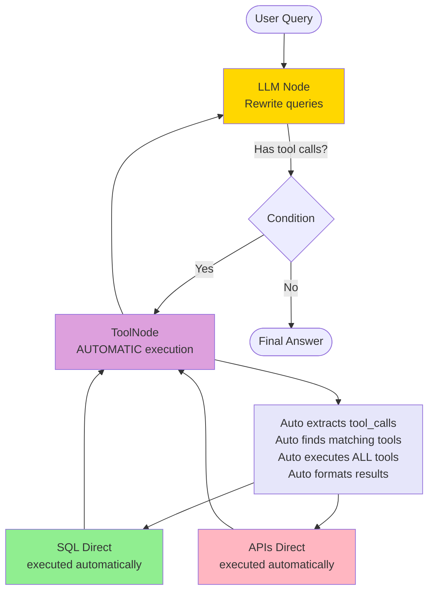
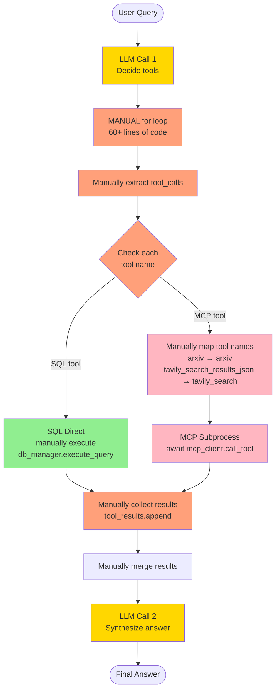

# Chatbot with MCP and LangGraph

Three approaches to building an AI chatbot with tool calling: simple LLM, LangGraph iterative, and MCP subprocess execution.

---

## most simple workflow


## 1. `/search` - Simple LLM Query

LLM has tools bound but doesn't execute them - returns raw response.


**Features:**
- ❌ Tools bound but never executed
- ❌ No tool result synthesis
- ⚠️ Response may contain tool call requests as text

**Use case:** Demo of non-functional tool binding

---

## 2. `/search_graph` - LangGraph Iterative

Automatic tool execution with looping via LangGraph's ToolNode.



**Features:**
- ✅ Automatic tool execution & looping via `ToolNode(tools)` - ONE LINE
- ✅ All tools direct execution (SQL, ArXiv, Wikipedia, Tavily)
- ✅ LangGraph handles iteration logic automatically

**Code:** Just one line for tool execution!
```python
builder.add_node("tools", ToolNode(app.state.tools))  # That's it!
```

**Use case:** Complex multi-step queries with full automation

---

## 3. `/search_mcp` - Single-Pass with MCP

Manual execution with MANUAL loop, MCP subprocess for some tools.



**Features:**
- ⚠️ Manual tool orchestration (60+ lines of custom loop code)
- ✅ MCP subprocess (arxiv, wikipedia, tavily) - isolated execution
- ✅ SQL direct execution - fast local execution
- ❌ No automatic looping (single-pass only)
- ⚠️ Requires manual tool name mapping
- ⚠️ Requires manual result collection

**Code:** Manual loop for tool execution
```python
# You write this manually (search_mcp.py lines 105-164):
if hasattr(ai_message, "tool_calls") and ai_message.tool_calls:
    for tool_call in ai_message.tool_calls:  # Manual loop
        tool_name = tool_call["name"]
        tool_args = tool_call["args"]

        if tool_name == "query_sales_database_impl":
            result = db_manager.execute_query(sql_query)  # Manual SQL
        else:
            mcp_tool_name = mcp_tool_name_map.get(tool_name)  # Manual mapping
            result = await mcp_client.call_tool(mcp_tool_name, args)  # Manual MCP

        tool_results.append(result)  # Manual collection
```

**Use case:** Demonstrating MCP protocol with fine-grained control

---

## 4. Hybrid: LangGraph + MCP *(concept, not implemented)*

Combines automatic iteration with MCP isolation.


**Why this is ideal:**
- ✅ LangGraph automatic iteration
- ✅ SQL direct (fast)
- ✅ MCP subprocess (isolated)

---

## Comparison

| Feature | `/search` | `/search_graph` | `/search_mcp` | Hybrid *(concept)* |
|---------|-----------|----------------|---------------|-------------------|
| Tool orchestration | ❌ None | ✅ **Automatic** (ToolNode) 1 line | ⚠️ **Manual** (custom code) 60+ lines | ✅ Automatic (ToolNode) |
| Looping | ❌ No | ✅ Yes (automatic) | ❌ No (single-pass) | ✅ Yes (automatic) |
| Tool execution logic | ❌ No | ✅ Hidden in ToolNode | ⚠️ **Visible** (you write it) | ✅ Hidden in ToolNode |
| SQL execution | ❌ No | ✅ Direct (auto) | ✅ Direct (manual) | ✅ Direct (code) |
| MCP subprocess | ❌ No | ❌ No | ✅ Yes (manual call) | ✅ Yes (via ToolNode) |
| API tools (arxiv, wiki, tavily) | ❌ No | ✅ Direct (auto) | ✅ MCP subprocess (manual) | ✅ MCP subprocess |
| Code complexity | Low | **Very Low** (abstracted) | **High** (explicit) | Very Low |
| Fine-grained control | ❌ No | ❌ No | ✅ **Yes** (full control) | ❌ No |
| Best for | Demo | Complex workflows | **MCP demo & custom logic** | Production |

---

## Key Concepts

**Query Rewriting:** Done by LLM, not MCP
- User: "How many sales and weather in Taipei?"
- LLM rewrites: `{"sql": "SELECT COUNT(*)", "query": "weather Taipei"}`

**MCP Role:** Execute tools in subprocess, not rewrite queries

**Schema Pre-fetching:** Database schema cached at startup, injected in prompts

---

## Hybrid Approach: LangGraph + MCP *(concept)*

This combines the strengths of both architectures:

**From LangGraph:**
- Automatic iteration and looping
- Unified tool interface via `ToolNode`
- Parallel tool execution
- Error recovery and retry capability

**From MCP:**
- Process isolation (tools can crash safely)
- ersion delegation to protocol providers

**Combined Benefits:**
- ✅ Best of both: iteration + isolation
- ✅ Direct SQL (fast) + MCP subprocess (safe)

**Example:** Complex query requiring multiple tools with automatic retry/refinement.


**Key difference from current implementations:**
- Loop back to LLM is automatic (not shown in single-pass `/search_mcp`)
- All tools accessible through one unified `ToolNode`
- MCP tools wrapped as LangChain tools for seamless integration